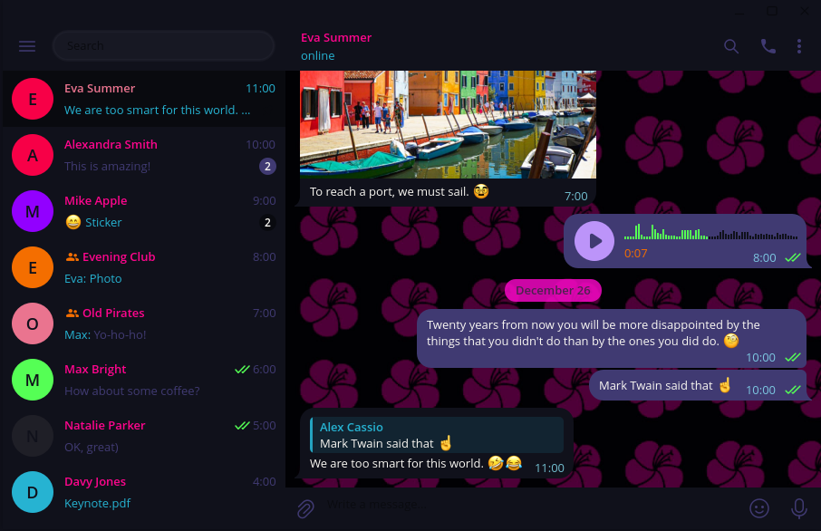

# Blossom Theme for Telegram Desktop

## Preview


## Installation
1. Navigate to [https://t.me/addtheme/officialblossomtheme](https://t.me/addtheme/officialblossomtheme).
2. You will be redirected to Telegram Desktop.
3. Click apply theme when prompted.

OR

1. Clone or Download the repo.
```git clone https://github.com/BlossomTheme/Telegram-Desktop```
2. In Telegram, Open Settings and navigate to Chat Settings.
3. Click the menu icon (three dots) and select "Create new theme", then "Import existing theme".
4. Choose the "colors.tdesktop-theme" file you downloaded.
5. Confirm by selecting "Keep Changes".
6. Save the new theme.
7. Name the theme "BlossomTheme", then select "Choose from file" and pick the "[backround.png](./background.png)" file you downloaded.
8. Finalize by clicking "Save" to set the background.
